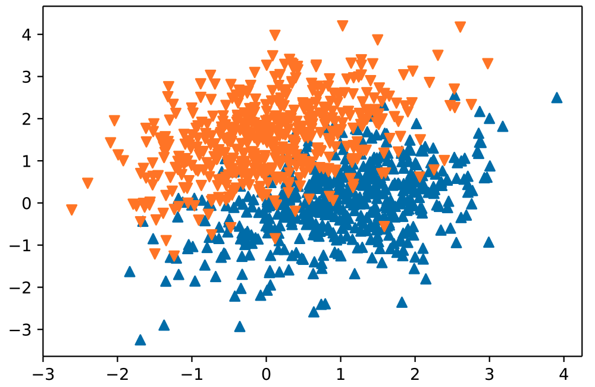
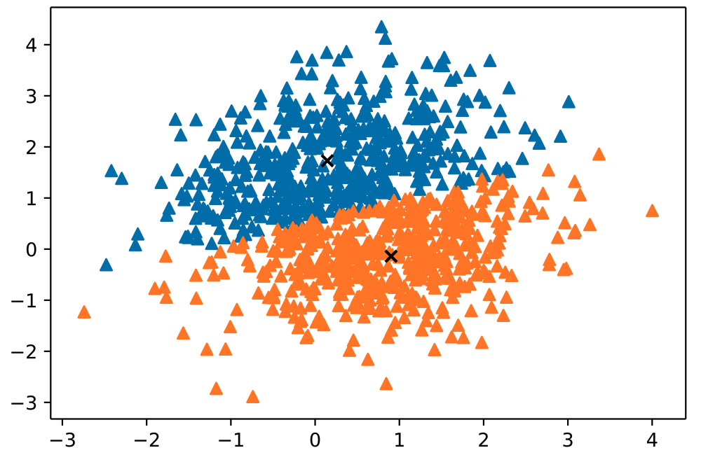
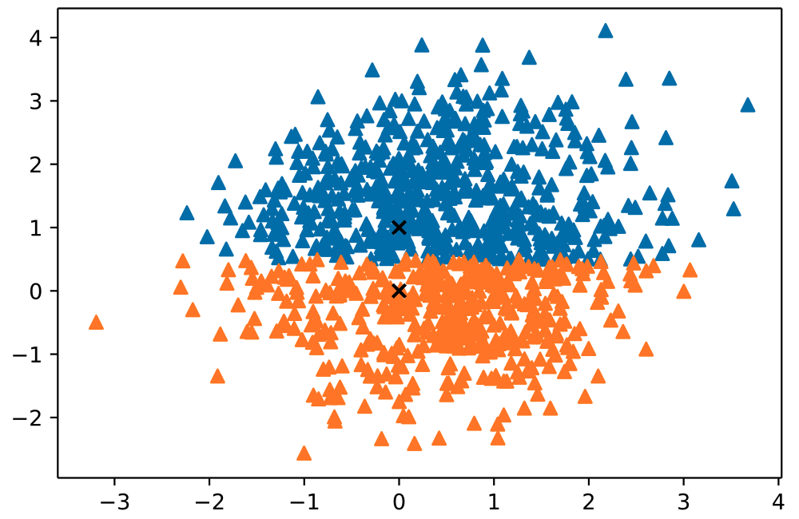
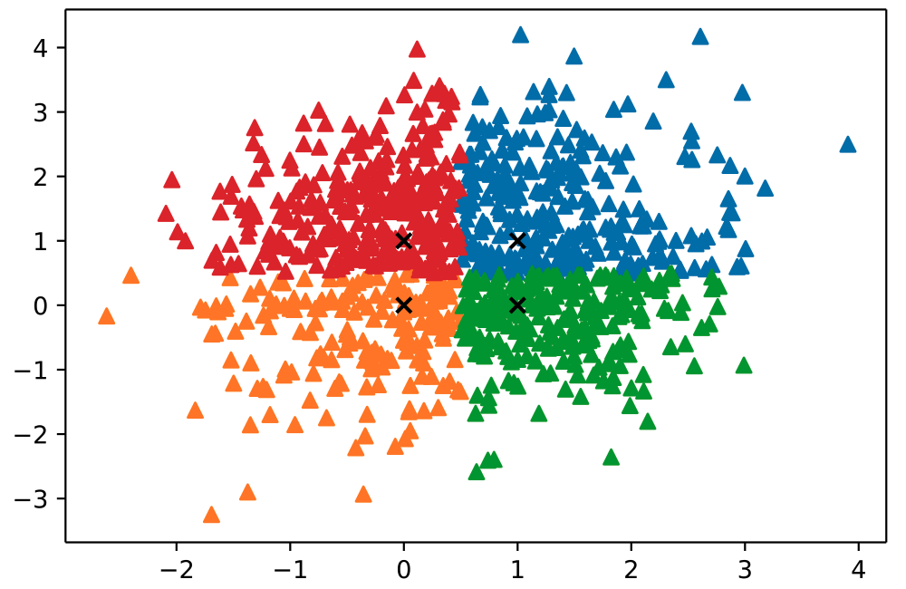
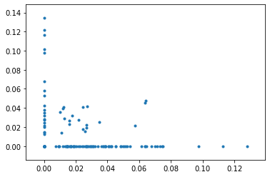
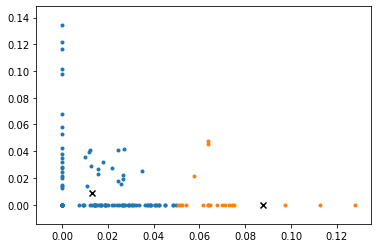
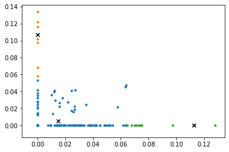
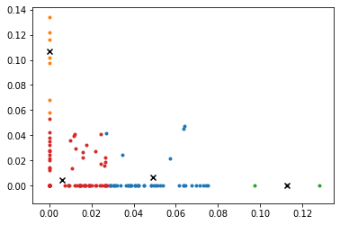

# CSE 5334 Data Mining

- Student ID: 1001778270
- Name: Bo Lin

## Homework 1

- Python: 3.7.6
- Numpy: 1.18.1
- Pandas: 1.0.1
- Matplotlib: 3.1.3
- NLTK: 3.4.5

## Usage

- without visualization

Please follow the step in python script `test.py` and run the following command

```sh
python test.py
```

- with visualization

please follow the step in ipython notebook `test.ipynb`

## Result

### Problem 1

- 2D Gaussian
  


- 2 clusters without given centers



- 2 clusters with given centers



- 4 clusters with given centers



### Problem 2

- tf-idf weight matrix


> image file in `assets/weight.png`

- 5 postive and 5 negative weight matrix


> image file in `assets/10_words_weight.png`

- docs vector



- docs vector in 2 clusters



- docs vector in 3 clusters



- docs vector in 4 clusters


