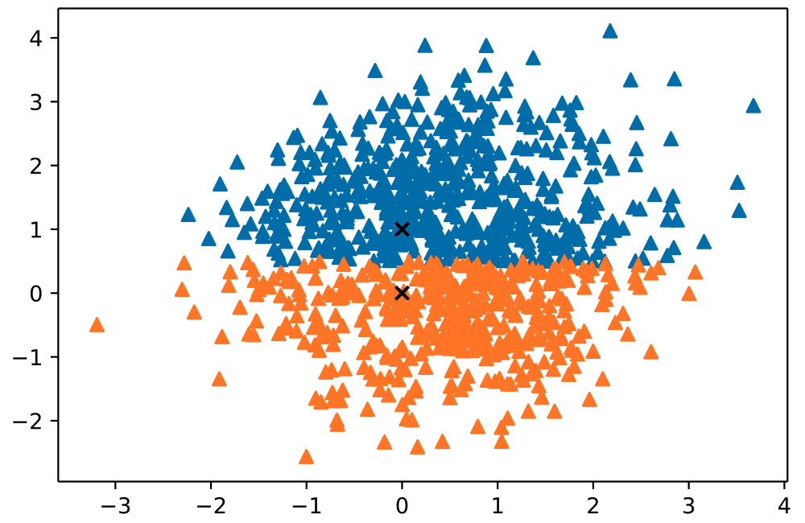
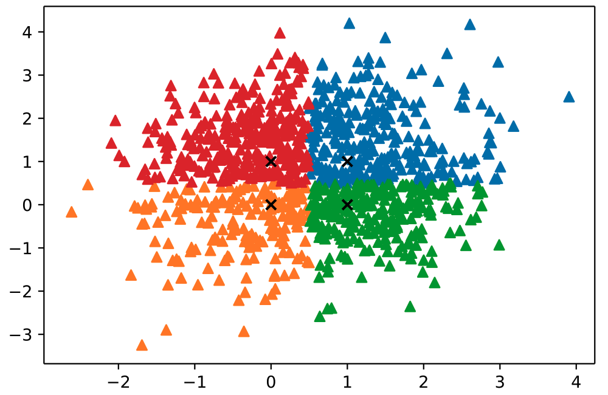
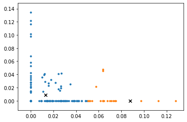
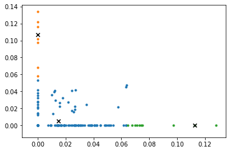

# CSE 5334 Data Mining

- Student ID: 1001778270
- Name: Bo Lin

## Homework 1

### Implementation

#### Requirements

- Python: 3.7.6
- Numpy: 1.18.1
- Pandas: 1.0.1
- Matplotlib: 3.1.3
- NLTK: 3.4.5

#### Detail

##### Problem 1

- **Assignment initial centers**

1. Randomly select a sample as the first clustering center c1;
2. Calculate the shortest distance between each sample and the existing clustering center,and use D(x); the larger the
   value, the greater the probability of being selected as the clustering center; finally, Use the traverse method to
   select the next cluster center;
3. Repeat step two until k cluster centers are selected.

- **Update**

update m until the convergence:

$$m_i^{(t + 1)} = \frac{1}{|S_i^{(t)}|}\sum_{x_j\in S_i^{(t)}}{x_j}$$

##### Problem 2

- **Preprocessing**

1. lowercase
2. remove punctuation
3. remove stop words
4. lemmatize

- **TF**

$${tf}_{i,j} = \frac{n_{i,j}}{\sum_k{n_{k,j}}}$$

where $n_{i,j}$ is the number of occurrences in $d_{j}$，The denominator is the sum of the occurrences of all words in file $d_{j}$

- **IDF**

$${idf}_i = \lg\frac{|D|}{|\{j:t_i \in d_j\}|}$$

where $|D|$ is the total number of files in the corpus, $|\{j:t_i \in d_j\}|$ is the number of files containing the word $t_{i,j}$, generally use $1 + |\{j:t_i \in d_j\}|$

- **TF-IDF**

$${tfidf} = tf * idf$$

- **Postive and Negative words**

| Postive   | Negative     |
| --------- | ------------ |
| amazing   | bad          |
| favourite | fake         |
| best      | poor         |
| good      | disappointed |
| great     | negative     |

### Result

#### Problem 1

- 2D Gaussian
  

- 2 clusters without given centers

- 2 clusters with given centers

- 4 clusters with given centers

#### Problem 2

- tf-idf weight matrix

> image file in `assets/weight.png`

- 5 postive and 5 negative weight matrix

> image file in `assets/10_words_weight.png`

- docs vector

- docs vector in 2 clusters

- docs vector in 3 clusters

- docs vector in 4 clusters

