# CSE 5334 Data Mining

- Student ID: 1001778270
- Name: Bo Lin

## Implementation

### Requirements

- Python: 3.7.7
- Numpy: 1.18.2
- Pandas: 1.0.3
- Matplotlib: 3.2.1
- NLTK: 3.4.5
- Scikit-Learn: 0.22.2.post1

## Result

### Problem 1

#### 1.1

- 1.1.1

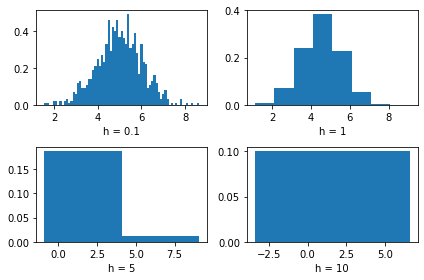

- 1.1.2

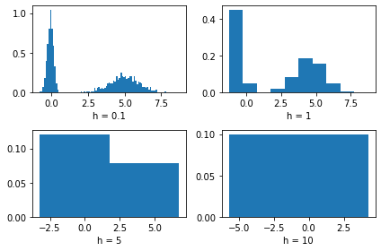

#### 1.2

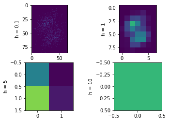

### Problem 2

#### 2.1

- 2.1.1

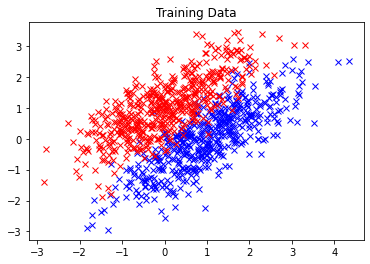

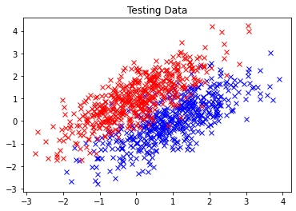

- result

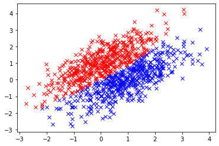

Accuracy: 0.9210000

Precision: 0.9168317

Recall: 0.9260000

Confusion Matrix
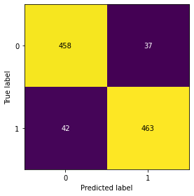

- 2.1.2

```
Sample N = 10
  Accuracy: 0.7380000
 Precision: 0.7102473
    Recall: 0.8040000
Sample N = 20
  Accuracy: 0.8360000
 Precision: 0.8414634
    Recall: 0.8280000
Sample N = 50
  Accuracy: 0.8580000
 Precision: 0.8683128
    Recall: 0.8440000
Sample N = 100
  Accuracy: 0.9020000
 Precision: 0.8988095
    Recall: 0.9060000
Sample N = 300
  Accuracy: 0.9140000
 Precision: 0.9173387
    Recall: 0.9100000
Sample N = 500
  Accuracy: 0.9210000
 Precision: 0.9168317
    Recall: 0.9260000
```

Accuracy

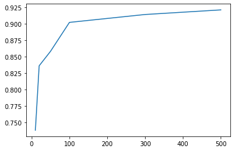

With the increase of training data, our classifier is more robust and the 
decision boundary of classification is more accurate

- 2.1.3

Class 0: 700, Class 1: 300

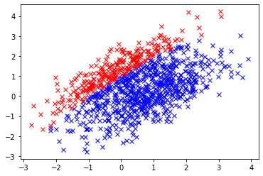

Accuracy: 0.7690000

Precision: 0.9963100

Recall: 0.5400000

Unbalanced training data will make the classifier classify sample into the classes
which have more samples

#### 2.2

Equal number of samples

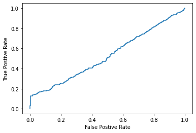

AUC: 0.530172

Unequal number of samples

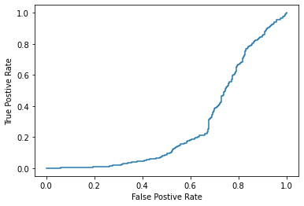

AUC: 0.271008

#### 2.3

```
1-Fold: 159 training data, 40 testing data
  Accuracy: 0.4500000
 Precision: 0.0000000
    Recall: 0.0000000
2-Fold: 159 training data, 40 testing data
  Accuracy: 0.4750000
 Precision: 0.0000000
    Recall: 0.0000000
3-Fold: 159 training data, 40 testing data
  Accuracy: 0.4250000
 Precision: 0.0000000
    Recall: 0.0000000
4-Fold: 159 training data, 40 testing data
  Accuracy: 0.4500000
 Precision: 0.0000000
    Recall: 0.0000000
5-Fold: 160 training data, 39 testing data
  Accuracy: 0.4102564
 Precision: 0.0000000
    Recall: 0.0000000
```