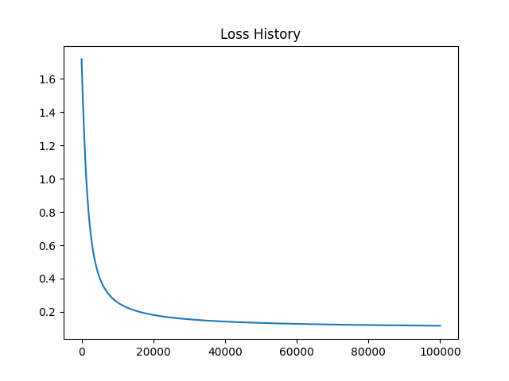
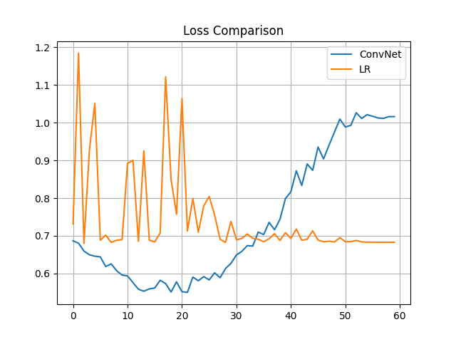

# CSE 5334 Data Mining

- Student ID: 1001778270
- Name: Bo Lin

## Implementation

### Requirements

- Python: 3.7.7
- Numpy: 1.18.2
- Matplotlib: 3.2.1

## Result

### Question 1

- Mode=batch, lr=1

```plain
Iter: 795/100000, Loss: 0.10455, Norm: 0.00100/0.00100
Mode: batch, LR: 1, Iter: 795, Accuracy: 0.95200
```


- Mode=batch, lr=0.1

```plain
Iter: 7924/100000, Loss: 0.10455, Norm: 0.00100/0.00100
Mode: batch, LR: 0.1, Iter: 7924, Accuracy: 0.95200
```


- Mode=batch, lr=0.01

```plain
Iter: 79594/100000, Loss: 0.10455, Norm: 0.00100/0.00100
Mode: batch, LR: 0.01, Iter: 79594, Accuracy: 0.95200
```


- Mode=batch, lr=0.001

```plain
Iter: 100000/100000, Loss: 0.11650, Norm: 0.02106/0.00100
Mode: batch, LR: 0.001, Iter: 100000, Accuracy: 0.95400
```





- Mode=online, lr=1

```plain
Iter: 100000/100000, Loss: 0.00015, Norm: 0.00097/0.00100
Mode: online, LR: 1, Iter: 100000, Accuracy: 0.51200
```


- Mode=online, lr=1

```plain
Iter: 100000/100000, Loss: 0.00016, Norm: 0.00099/0.00100
Mode: online, LR: 0.1, Iter: 100000, Accuracy: 0.76000
```


- Mode=online, lr=1

```plain
Iter: 100000/100000, Loss: 0.00016, Norm: 0.00100/0.00100
Mode: online, LR: 0.01, Iter: 100000, Accuracy: 0.73400
```


- Mode=online, lr=1

```plain
Iter: 100000/100000, Loss: 0.00016, Norm: 0.00100/0.00100
Mode: online, LR: 0.001, Iter: 100000, Accuracy: 0.72600
```


### Question 2

- 1

```plain
MLP(
  (hidden_1): Linear(in_features=1024, out_features=64, bias=True)
  (output): Linear(in_features=64, out_features=10, bias=True)
  (relu): ReLU(inplace=True)
)
```

Best Result

|       | Testing Result |
| ----- | -------------- |
| Epoch | 092            |
| Loss  | 1.67371        |
| Acc   | 0.42070        |

see [training log](q2/log/train_mlp_one_layer.log)

- 2

```plain
MLP(
  (hidden_1): Linear(in_features=1024, out_features=64, bias=True)
  (hidden_2): Linear(in_features=64, out_features=64, bias=True)
  (output): Linear(in_features=64, out_features=10, bias=True)
  (relu): ReLU(inplace=True)
)
```

Best Result

|       | Testing Result |
| ----- | -------------- |
| Epoch | 072            |
| Loss  | 1.60115        |
| Acc   | 0.44140        |

see [training log](q2/log/train_mlp_two_layer.log)

- 3

```plain
MLP(
  (hidden_1): Linear(in_features=1024, out_features=64, bias=True)
  (dropout_1): Dropout(p=0.2, inplace=False)
  (hidden_2): Linear(in_features=64, out_features=64, bias=True)
  (dropout_2): Dropout(p=0.2, inplace=False)
  (output): Linear(in_features=64, out_features=10, bias=True)
  (relu): ReLU(inplace=True)
)
```

Best Result

|       | Testing Result |
| ----- | -------------- |
| Epoch | 098            |
| Loss  | 1.60119        |
| Acc   | 0.43060        |

see [training log](q2/log/train_mlp_dropout.log)

- 4

```plain
ConvNet(
  (conv1): Conv2d(1, 6, kernel_size=(5, 5), stride=(1, 1))
  (pool): MaxPool2d(kernel_size=2, stride=2, padding=0, dilation=1, ceil_mode=False)
  (relu): ReLU(inplace=True)
  (conv2): Conv2d(6, 16, kernel_size=(5, 5), stride=(1, 1))
  (fc1): Linear(in_features=400, out_features=120, bias=True)
  (dropout1): Dropout(p=0.5, inplace=False)
  (fc2): Linear(in_features=120, out_features=84, bias=True)
  (dropout2): Dropout(p=0.5, inplace=False)
  (fc3): Linear(in_features=84, out_features=10, bias=True)
)
```

Best Result

|       | Testing Result |
| ----- | -------------- |
| Epoch | 055            |
| Loss  | 1.00214        |
| Acc   | 0.66400        |

see [training log](q2/log/train_convnet_Cifar10.log)

- 5

```plain
ConvNet(
  (conv1): Conv2d(1, 6, kernel_size=(5, 5), stride=(1, 1))
  (pool): MaxPool2d(kernel_size=2, stride=2, padding=0, dilation=1, ceil_mode=False)
  (relu): ReLU(inplace=True)
  (conv2): Conv2d(6, 16, kernel_size=(5, 5), stride=(1, 1))
  (fc1): Linear(in_features=400, out_features=120, bias=True)
  (dropout1): Dropout(p=0.5, inplace=False)
  (fc2): Linear(in_features=120, out_features=84, bias=True)
  (dropout2): Dropout(p=0.5, inplace=False)
  (fc3): Linear(in_features=84, out_features=10, bias=True)
)
```

Best Result

|       | Testing Result |
| ----- | -------------- |
| Epoch | 058            |
| Loss  | 0.26158        |
| Acc   | 0.90930        |

see [training log](q2/log/train_convnet_FashionMNIST.log)

- 6

```plain
OneLayer(
  (linear): Linear(in_features=784, out_features=10, bias=True)
)
```

Best Result

|       | Testing Result |
| ----- | -------------- |
| Epoch | 089            |
| Loss  | 0.44085        |
| Acc   | 0.84530        |

see [training log](q2/log/train_onelayer.log)


- 7





see [training log](q2/log/train_mlp_two_layer.log)